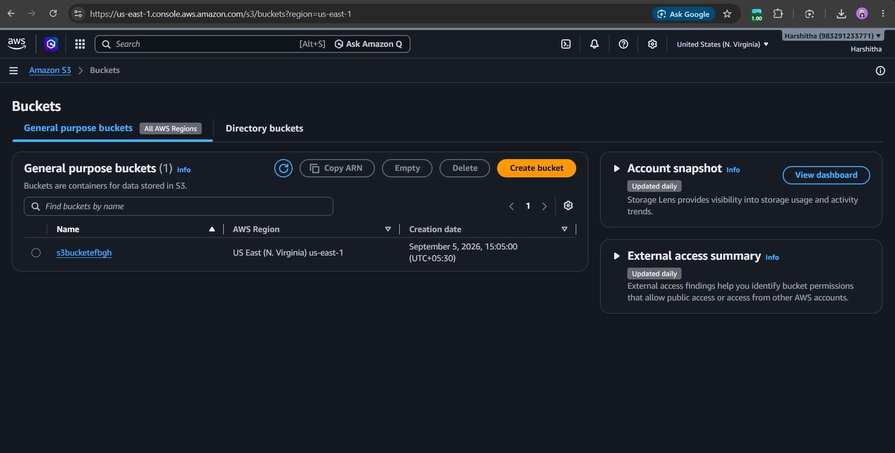
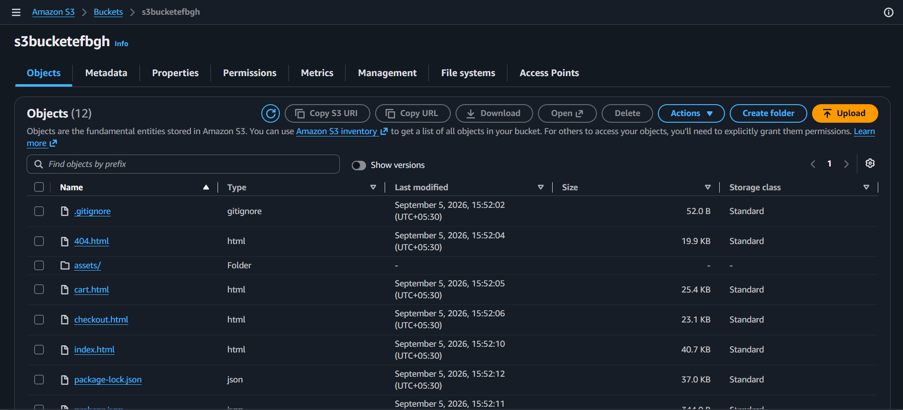

# Mini Project

## 🌐 Website Deployment using Amazon S3

This project is a static website that was deployed and hosted using **Amazon S3 (Simple Storage Service)**.

## 🛠️ Technologies Used

- HTML
- CSS
- JavaScript
- Amazon S3
- Git & GitHub

## ☁️ Deployment using AWS S3

The website was deployed using an Amazon S3 bucket.

### Deployment Steps

1. Created an Amazon S3 bucket.
2. Configured the bucket for website hosting.
3. Uploaded the website files to the S3 bucket.
4. Used the S3 bucket to host the static website.

## 📸 Deployment Screenshots

### 1. S3 Bucket Created

The screenshot below shows the S3 bucket created for hosting the website.

### 2. Website Files Uploaded

The screenshot below shows the website files uploaded to the S3 bucket.

## 🚀 Hosting

**Hosting Platform:** Amazon S3  
**Version Control:** GitHub
